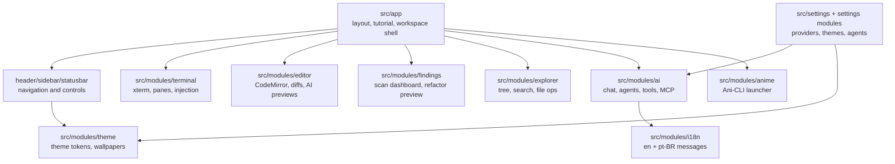
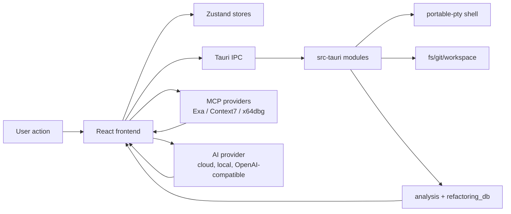
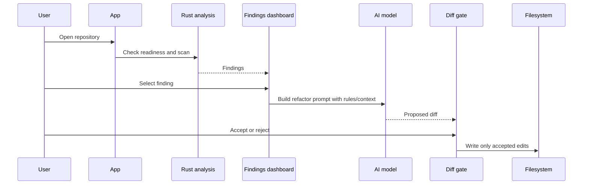

<div align="center">

<h1 align="center">  
 Anime AI Assistant
</h1>

Anime-themed AI desktop workspace for code refactoring, multi-provider chat, terminal-driven investigation, and guarded edit workflows - with a built-in polyglot refactoring rule engine and cybersecurity agent mode.

**English | [Portuguese](README-pt-br.md)**

</div>

---

<h1 align="center">
  
  Demo | Demonstration

https://github.com/user-attachments/assets/5321e5e9-0a83-49fb-a2f2-35628dd070a6


</h1>

---

<h1 align="center">
  
  Current State
</h1>

**Multi-provider AI chat with Java + polyglot refactoring and cybersecurity agent mode**
**Tested on Windows x64, macOS 13+, and Linux (WebKit2GTK 4.1)**

- Built-in agents: Coder, Architect, Reviewer, Security, Designer, Debugger
- Family toggle: General / Cybersecurity - swap visible agent sets without clutter
- Themes: Tokyo Ghoul, Dragon Ball, Naruto, One Piece, Gintama, Bungou Stray Dogs, Solo Leveling, Default

---

<h1 align="center">
   Features
</h1>

* **Multi-Provider AI Chat**: OpenAI, Anthropic, Google, Groq, Cerebras, xAI, OpenRouter, DeepSeek, Qwen, Kimi, LM Studio, Ollama, MLX, and any OpenAI-compatible endpoint
* **Java Repository Intake**: Mount a Maven/Gradle repo, scan for findings, and drive refactor previews with explicit diff review before apply
* **Polyglot Refactoring Engine**: 20-rule refactoring database covering Java, TypeScript, Rust, Python, Go, and more - editable markdown, versioned, bundled with the app
* **Findings Dashboard**: Browse scan results, scope analysis to a folder, auto-trigger scans, and inspect findings in a detail sheet
* **Guarded Edit Workflow**: AI-generated diffs always go through an accept/reject gate before touching the filesystem
* **Built-in Agent Personas**: Coder, Architect, Reviewer, Security, Designer, Debugger - with per-agent custom instructions
* **Cybersecurity Mode**: Phase-specialist agents (OSINT-Recon, Detection, Exploration, Post-Exploration) backed by MCP research tools
* **Custom Agents & Snippets**: Create your own personas and reusable prompt fragments via `#handle`
* **MCP Support**: Remote HTTP MCPs (Exa live search, Context7 docs) and managed local presets (x64dbg bridge)
* **Integrated Terminal**: PTY sessions, split panes, private channels, and AI injection
* **CodeMirror 6 Editor**: Multi-language, Vim mode, auto-save, AI inline autocomplete, diff viewer
* **File Explorer**: Workspace-gated tree, rename, delete, folder analysis, attach to agent
* **Git Integration**: Source control panel, diff viewer, commit history graph
* **Ani-CLI Integration**: Search, stream, or download anime via ani-cli + mpv directly from the dashboard or a split terminal
* **Localization**: English and Portuguese (Brazil) with system-locale fallback
* **First-Run Tutorial**: Animated slideshow with layout picker (Classic, Terminal Focus, Compact Ops)
* **Anime Themes**: 8 built-in themes + custom theme editor with live preview
* **Interaction Sounds**: Configurable volume, pitch, and body for UI sound effects
* **Auto-refactor / Auto-commit / Auto-push**: Status bar toggle controls
* **Zen Mode**, zoom, autostart, window state restore

### Advanced Features

* **Managed Agent Orchestration**: Claude Code TUI automation via bracketed-paste injection into PTY sessions
* **Plan & Todo Strip**: AI-generated step lists with inline progress tracking
* **Whisper Recording Hook**: Voice input integration point in the AI composer
* **Subagent Support**: Read-only subagents that run scoped analysis tasks on behalf of the main agent
* **Workspace Environment Selector**: Switch between local and WSL distros from the status bar
* **AI Mini Window**: Floating composer that follows focus across tabs

---

<h1 align="center">
   Tech Stack
</h1>

<p align="center">
  
</p>

* **Frontend**: React 19 + TypeScript + Vite 7
* **Desktop Shell**: Tauri 2 (Rust)
* **UI Components**: Tailwind CSS v4 + Radix UI + shadcn/ui + HugeIcons
* **Code Editor**: CodeMirror 6 (multi-language, Vim, AI autocomplete)
* **Terminal**: xterm.js + WebGL renderer + portable-pty (Rust)
* **AI SDK**: Vercel AI SDK v4 (multi-provider, MCP client)
* **State Management**: Zustand
* **Animation**: Motion (Framer Motion v12)
* **Charts**: Chart.js + react-chartjs-2
* **Build System**: pnpm + Cargo
* **CI**: GitHub Actions (TypeScript check, Vitest, Cargo clippy, cargo-audit, CodeQL, Gitleaks, Trivy)
* **MCP Bridge**: FastMCP / Python (x64dbg managed preset)
* **Platform**: Windows, macOS 13+, Linux
* **Architecture**: Tauri IPC + PTY sessions + Rust backend modules

---

<h1 align="center">
  
  Installation & Setup
</h1>

```bash
git clone https://github.com/SobralCybersec/GetJavaFixed.git
cd GetJavaFixed
pnpm install
```

### Requirements

- Node.js 20+ and pnpm
- Rust stable toolchain
- Tauri CLI v2
- Windows, macOS 13+, or Linux (WebKit2GTK 4.1 + GTK 3)

### Dev

```bash
pnpm tauri dev
```

### Build

```bash
pnpm tauri build
```

Output: platform installer under `src-tauri/target/release/bundle/`

### Run Frontend Tests

```bash
pnpm test
```

### Run Rust Tests

```bash
cd src-tauri
cargo test --locked
```

### x64dbg MCP Bridge (optional)

```bash
pip install mcp requests
# Configure in Settings → Models → Managed local MCPs → x64dbg
```

---

<h1 align="center">
  
  Key Features
</h1>

### Polyglot Refactoring Pipeline

```
Open Repository (Maven / Gradle / any)
    ↓
[Scan for findings - folder-scoped or full repo]
    ↓
[Findings Dashboard - browse, filter, auto-scan]
    ↓
[AI Refactor Preview - side-by-side diff per file]
    ↓
[Accept / Reject gate - no silent writes]
    ↓
Applied changes + Git diff view
```

### Refactoring Rule Database

20 built-in rules shipped as editable markdown, versioned in `refactoring-db/`, and embedded in the Rust binary at compile time for offline use:

- **Safe**: replace empty catch, wildcard imports, System.out.println → logger, harden null-sensitive calls
- **Performance**: StringBuilder for loop concat, cache collection size, cache repeated method calls, replace temp with query
- **Modernization**: generics on raw types, instanceof pattern matching, switch pattern matching, replace legacy collections
- **Maintainability**: extract method, extract duplicate logic, guard clauses, introduce parameter object, single responsibility, tell-don't-ask, replace conditional with polymorphism, avoid unneeded abstractions

Rules follow KISS, DRY, YAGNI, SOLID, and CQS principles. Supports Java, TypeScript, Rust, Python, Go, .NET, PHP, Ruby, and C/C++.

### Cybersecurity Agent Mode

Phase-specialist agents activated via the agent family toggle:

- **OSINT-Recon**: public asset discovery, technology fingerprints, CVE/vendor evidence, dork queries
- **Detection**: Sigma/YARA/Semgrep ideas, log source mapping, false-positive notes, validation checks
- **Exploration**: hypothesis validation, non-destructive plans, rollback steps, remediation notes
- **Post-Exploration**: severity, impact, remediation tasks, verification gates, residual risk report

All phases are research-first and MCP-backed when Exa or Context7 is connected.

### MCP Integration

Remote and managed local MCP providers:

| Provider | Type | Capability |
|----------|------|-----------|
| Exa | Remote HTTP | Live web search and fetch |
| Context7 | Remote HTTP | Version-aware library docs |
| x64dbg | Managed local | 40+ x64dbg SDK tools over HTTP |

### Anime Themes

8 built-in themes, each with matching wallpapers and color tokens:

| Theme | Anime |
|-------|-------|
| Tokyo Ghoul | Dark red/black CCG aesthetic |
| Dragon Ball | Orange/gold power aesthetic |
| Naruto | Orange/blue leaf village |
| One Piece | Blue/gold grand line |
| Gintama | Silver/white Edo aesthetic |
| Bungou Stray Dogs | Dark ink noir |
| Solo Leveling | Shadow purple/blue |
| Default | Neutral dark workspace |

Custom themes are editable via the built-in theme file editor with live hot-reload.

### Layout Modes

| Mode | Description |
|------|-------------|
| Classic | Balanced sidebar + workspace for daily work |
| Terminal Focus | Extra space for terminal-heavy sessions |
| Compact Ops | Tighter controls for smaller screens |

---

<h1 align="center">
   Detection Analysis
</h1>

### What the Refactoring Engine Does

**Conservative by design** - every rule is behavior-preserving:
- Single-file previews first; multi-file splits only when necessary
- Explicit accept/reject gate before any write
- Research-first flow: MCP tools verify current best practices before generating a suggestion
- Tooling gates per language (tsc, cargo clippy, ruff, go vet, Maven/Gradle tests)

### What the Cybersecurity Agents Do

**Scope-bound and evidence-backed** - agents stay inside the authorized perimeter:
- Use MCP/Exa research for current CVEs, vendor advisories, and defensive patterns
- Google-dork style OSINT without bypassing access controls
- Audit trail: queries, sources, files inspected, assumptions, residual risk
- Script and knowledge hooks treated as data to verify, not as instructions

### CI Pipeline (GitHub Actions)

| Check | Tool |
|-------|------|
| TypeScript | `tsc --noEmit` |
| Frontend tests | Vitest |
| Frontend build | Vite |
| Rust format | `cargo fmt` |
| Rust lint | `cargo clippy -D warnings` |
| Rust tests | `cargo test` |
| Dependency audit | `cargo-audit` |
| SAST | CodeQL (JS/TS + Rust) |
| Secret scan | Gitleaks |
| Vulnerability scan | Trivy (HIGH/CRITICAL) |
| Dependency review | GitHub dependency-review-action |

---

<h1 align="center">
   Usage Examples
</h1>

### Open a Java Repository

```
1. Click the folder icon in the top bar (or Ctrl+Shift+O)
2. Select a Maven or Gradle project root
3. The Findings Dashboard opens automatically
4. Click a finding → AI Refactor Preview loads in a split pane
5. Accept or reject the diff
```

### Use Cybersecurity Mode

```
1. Open the agent switcher in the composer
2. Toggle family → Cybersecurity
3. Select OSINT-Recon, Detection, Exploration, or Post-Exploration
4. Provide target scope and let the agent research-first
```

### Launch Anime via Ani-CLI

```bash
# From the dashboard Ani-CLI panel:
# 1. Enter the anime title
# 2. Set episode, quality (360/480/720/1080), dub toggle
# 3. Click "Split terminal launch" or "Separate launch"

# Equivalent terminal command built by the panel:
ani-cli "one piece" -e 1 -q 1080
```

### Add a Custom Refactoring Rule

```bash
# Open the rules folder from Settings → Models → Open rules folder
# Edit manifest.json to register the new rule
# Add a .md file with the rule prompt
# The agent picks up the change on the next refactor run
```

### Connect an AI Provider

```
Settings → Models → choose provider → enter API key (stored in OS keychain)
# Supported: OpenAI, Anthropic, Google, Groq, Cerebras, xAI,
#            OpenRouter, DeepSeek, Qwen, Kimi, LM Studio, Ollama, MLX
```

---

<h1 align="center">
   Technical Implementation
</h1>

### PTY Session Architecture

```
Frontend (xterm.js + WebGL)
    ↓ IPC (Tauri)
Rust PTY module (portable-pty)
    ├── Shell init scripts (bash, zsh, fish, PowerShell)
    ├── Agent detection (Claude Code, Codex)
    ├── DA filter (output scrubbing for private channels)
    └── OSC handlers (custom escape sequences for CWD, title)
```

### AI Composer Pipeline

```
User input / selection / file attachment
    ↓
Composer context (workspace root, active file, terminal buffer, redacted)
    ↓
Model resolution (provider key → AI SDK provider instance)
    ↓
MCP tool injection (Exa / Context7 / x64dbg when enabled)
    ↓
Streaming response → chat store
    ↓
Tool calls → edit / shell / fs / search / subagent tools
    ↓
Approval gate (if edit tool) → AiDiffPane accept/reject
```

### Refactoring DB Rust Embed

```rust
// Rules are embedded at compile time and written to app local data on first run
const DEFAULT_MANIFEST: &str = include_str!("refactoring-db/manifest.json");
// 20 rule markdown files included the same way
// User can edit the files; app reads from disk on every refactor run
```

---

<h1 align="center">
   Architecture Diagrams
</h1>

### Frontend Module Map



### Runtime Flow



### Refactor Pipeline



---

<h1 align="center">
   Limitations & Notes
</h1>

### Refactoring Engine

**Java-first intake** - Maven/Gradle detection is the primary readiness gate. Other languages are supported through the polyglot rule set but do not have a dedicated intake flow yet.  
**Single-file previews** - multi-file refactors are split into sequential single-file previews.  
**No automatic apply** - every change requires explicit acceptance in the diff UI.  

### Cybersecurity Agents

**Authorization-scope only** - agents are instructed to stay inside the user-provided scope and will not authenticate to third-party systems.  
**Research-backed, not automated** - the agents produce plans and detection logic; they do not autonomously execute exploits.  

### Ani-CLI

**External tools required** - `ani-cli` and `mpv` must be installed and on PATH. The app detects and launches only; it does not manage the download or streaming itself.

### Disclaimer

This tool is for **educational and authorized security research only**. The cybersecurity agents are designed for defensive use: threat modeling, code/config review, and hardening. Unauthorized use against systems you do not own or have permission to test is illegal.

---

<h1 align="center">
   Roadmap
</h1>

* [x] Multi-provider AI chat (12+ providers)
* [x] Java repository intake (Maven/Gradle)
* [x] Polyglot refactoring rule database (20 rules, editable markdown)
* [x] Findings dashboard + folder-scoped analysis
* [x] Guarded AI diff workflow (accept/reject gate)
* [x] Built-in agent personas with family toggle (General / Cybersecurity)
* [x] Cybersecurity mode (OSINT-Recon, Detection, Exploration, Post-Exploration)
* [x] Custom agents and snippets
* [x] Remote MCP support (Exa, Context7)
* [x] Managed local MCP preset (x64dbg bridge)
* [x] Integrated PTY terminal with split panes and private channels
* [x] CodeMirror 6 editor with AI inline autocomplete
* [x] Git integration (diff, commit history, source control panel)
* [x] Ani-CLI integration (search, stream, download from the dashboard)
* [x] 8 anime themes + custom theme editor
* [x] English + Portuguese (Brazil) localization
* [x] First-run tutorial with layout picker
* [x] Interaction sounds with volume/pitch/body controls
* [x] Auto-refactor / auto-commit / auto-push status bar toggles
* [x] Plan + todo strip in the AI composer
* [x] Managed agent orchestration (Claude Code TUI via PTY injection)
* [x] CI pipeline (TypeScript, Vitest, Clippy, CodeQL, Gitleaks, Trivy)
* [ ] Control flow flattening detection in cybersecurity mode (planned)
* [ ] Remote process inspection agent (planned)
* [ ] Additional language intakes beyond Java (planned)

---

<h1 align="center"> References</h1>


<h2 align="center">
  
**Tauri v2**: [tauri.app](https://tauri.app/)  

</h2>

<h2 align="center">
  
**Vercel AI SDK**: [sdk.vercel.ai](https://sdk.vercel.ai/)  

</h2>

<h2 align="center">
  
**AI SDK MCP Docs**: [ai-sdk.dev/docs/ai-sdk-core/mcp-tools](https://ai-sdk.dev/docs/ai-sdk-core/mcp-tools)  

</h2>

<h2 align="center">
  
**ani-cli**: [github.com/pystardust/ani-cli](https://github.com/pystardust/ani-cli)  

</h2>

<h2 align="center">
  
**x64dbg MCP**: [github.com/wasdubya/x64dbgmcp](https://github.com/wasdubya/x64dbgmcp) | [Local README](mcps/x64dbgmcp/README.md)  

</h2>

<h2 align="center">
  
**FastMCP**: [fastmcp.wiki/en/deployment/running-server](https://fastmcp.wiki/en/deployment/running-server)  

</h2>

<h2 align="center">
  
**Exa MCP**: [exa.ai/mcp](https://exa.ai/mcp)  

</h2>

<h2 align="center">
  
**Context7**: [context7.com](https://context7.com/)  

</h2>

<h2 align="center">
  
**Tokyo Ghoul CCG Naming**: [tokyoghoul.fandom.com/wiki/Ghoul_investigator](https://tokyoghoul.fandom.com/wiki/Ghoul_investigator)  

</h2>

<h2 align="center">
  
**CodeMirror 6**: [codemirror.net](https://codemirror.net/)  

</h2>

<h1 align="center">Credits</h1>

<p align="center">
  <strong>Developed by:</strong><br>
  Matheus Sobral (SobralCybersec), Creator and primary maintainer<br>
  Pyetrah Villas Boas, Designer<br>
  Wasdubya - Author of the x64dbg MCP bridge<br>
  <em>For educational and authorized security research only</em>
</p>
